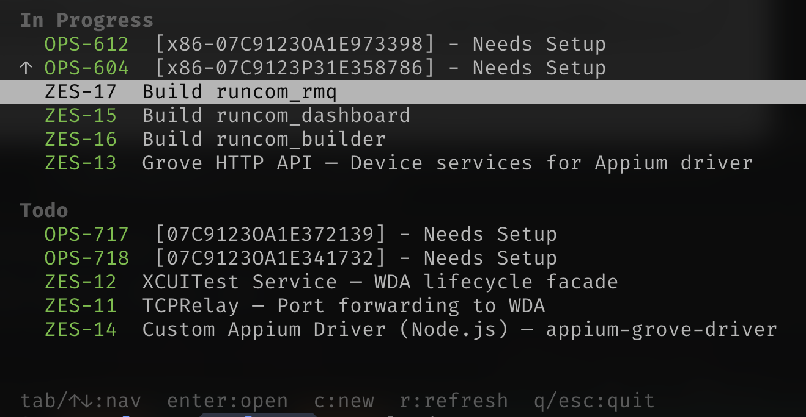
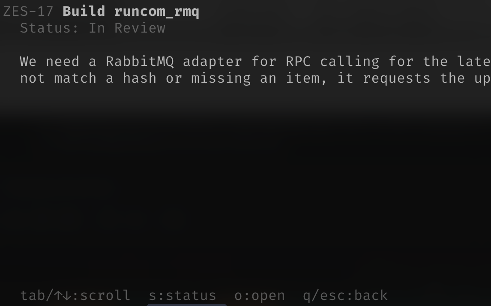
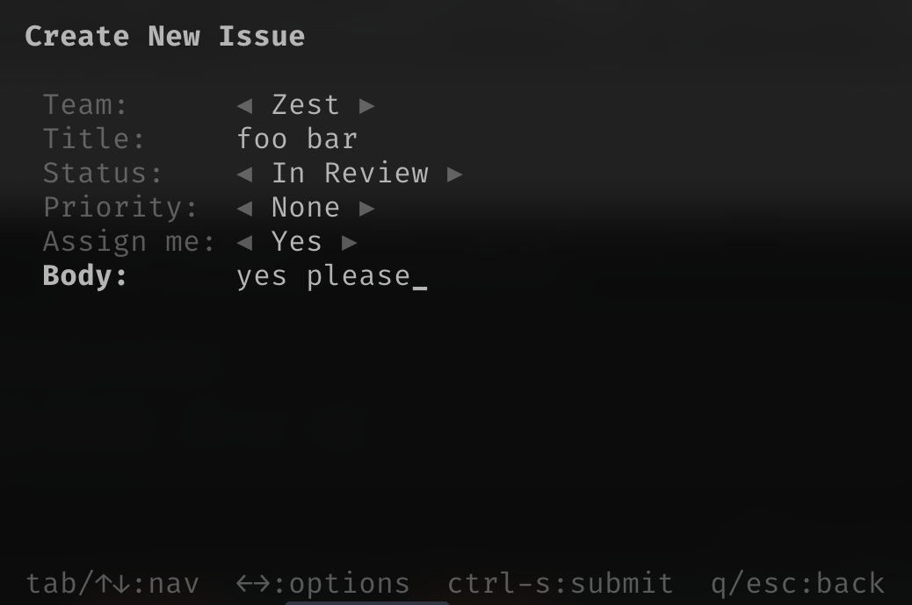

# Focus

A terminal UI for viewing your assigned Linear issues, keeping you focused on what to work on next. Built with Zig and [libvaxis](https://github.com/grimlockOS/libvaxis).

## Features

- Multi-workspace support for Linear
- Polls for updates every 15 minutes
- Separates "In Progress" from "Todo" issues, sorted by most recently updated
- Priority indicators (! Urgent, ↑ High, - Medium, ↓ Low)
- Inline status changes with `s` key
- Issue detail view with markdown rendering and comments
- Create new issues with `c`
- Open issues in browser (or Linear desktop app) with `o`
- JSON list mode for scripting (`--list`)







## Prerequisites

- [Zig 0.15+](https://ziglang.org/download/)

## Build

```sh
bin/build
```

The binary will be at `zig-out/bin/focus`.

## Setup

### 1. Create config file

Create `~/.config/focus/config.json`:

```json
{
  "default_team": "My Team",
  "linear": [
    {
      "api_key": "lin_api_YOUR_KEY",
      "workspace": "your-workspace-slug",
      "desktop_links": false,
      "default_team": "Platform"
    }
  ]
}
```

You can configure multiple Linear workspaces.

### 2. Get API keys

**Linear:** Go to **Settings > Account > API > Personal API keys** and create a key.

### 3. Run

```sh
zig-out/bin/focus
```

## Configuration

| Field                    | Description                              | Required |
|--------------------------|------------------------------------------|----------|
| `default_team`           | Default team name for new issues         | No       |
| `linear[].api_key`       | Linear personal API key                  | Yes      |
| `linear[].workspace`     | Workspace slug (enables clickable links) | No       |
| `linear[].desktop_links` | Use `linear://` URLs instead of web      | No       |
| `linear[].default_team`  | Default team name within this workspace  | No       |

## Keybindings

### List Mode

| Key                  | Action             |
|----------------------|--------------------|
| j / k / Tab / ↑↓     | Navigate           |
| G                    | Jump to bottom     |
| g                    | Jump to top        |
| Ctrl+D / Page Down   | Half-page down     |
| Ctrl+U / Page Up     | Half-page up       |
| Enter                | View issue detail  |
| o                    | Open in browser    |
| s                    | Change status      |
| c                    | Create new issue   |
| r                    | Refresh            |
| q / Esc              | Quit               |

### Detail Mode

| Key                  | Action             |
|----------------------|--------------------|
| j / k / Tab / ↑↓     | Scroll             |
| f / Space / Ctrl+D   | Page down          |
| b / Ctrl+U           | Page up            |
| s                    | Change status      |
| o                    | Open in browser    |
| q / Backspace / Esc  | Back to list       |

### Create Mode

| Key                  | Action             |
|----------------------|--------------------|
| Tab / ↑↓             | Navigate fields    |
| ←→                   | Cycle options      |
| Ctrl+S               | Submit             |
| q / Esc              | Back to list       |

## Development

Run directly:

```sh
bin/build
```

Run tests:

```sh
zig build test
```
